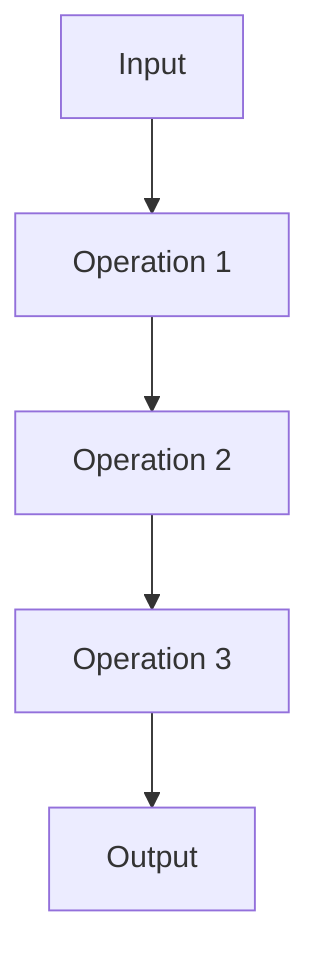

import { FileTree, Cards } from 'nextra/components'


# Pipeline Module

The Pipeline module provides a flexible API for building AI-powered processing pipelines with composable operations. Inspired by orchestration frameworks like Airflow and Dagster, it implements idiomatic Rust patterns for AI workflows.

## Overview

> This module defines a flexible pipeline API for defining a sequence of operations that
> may or may not use AI components (e.g.: semantic search, LLMs prompting, etc).
>
> The pipeline API was inspired by general orchestration pipelines such as Airflow, Dagster and Prefect,
> but implemented with idiomatic Rust patterns and providing some AI-specific ops out-of-the-box along
> general combinators.
>
> Pipelines are made up of one or more operations, or "ops", each of which must implement the [Op] trait.
> The [Op] trait requires the implementation of only one method: `call`, which takes an input
> and returns an output. The trait provides a wide range of combinators for chaining operations together.
>
> One can think of a pipeline as a DAG (Directed Acyclic Graph) where each node is an operation and
> the edges represent the data flow between operations. When invoking the pipeline on some input,
<FileTree.File name="rig-core/src/pipeline/mod.rs [1-13]"/>


## Core Concepts

### Operations (Ops)

Operations are the building blocks of pipelines. Each operation:
- Takes an input
- Performs processing
- Returns an output
- Implements the `Op` trait

```rust
use rig::pipeline::{self, Op};

// Simple operation that adds two numbers
let add_op = pipeline::new()
    .map(|(x, y)| x + y);

// Operation with async processing
let async_op = pipeline::new()
    .then(|x| async move { x * 2 });
```

### Pipeline Structure

Pipelines form a Directed Acyclic Graph (DAG) where:
- Nodes represent operations
- Edges represent data flow between operations
- Input flows from root to leaf nodes
- Output is returned from the final node

Example DAG visualization:


## Basic Usage

### Sequential Operations

Chain operations that execute one after another:

```rust
use rig::pipeline::{self, Op};

let pipeline = pipeline::new()
    .map(|(x, y)| x + y)     // Add numbers
    .map(|z| z * 2)          // Double result
    .map(|n| n.to_string()); // Convert to string

let result = pipeline.call((5, 3)).await;
assert_eq!(result, "16");
```

### Parallel Operations

Execute multiple operations concurrently using the `parallel!` macro:


```rust filename="rig-core/src/pipeline/parallel.rs [196:208]"
            ]
            values_and_positions: [
                $($acc)*
                $current ( $($underscores)* + )
            ]
            munching: []
        }
    );

    // Recursion step: map each value with its "position" (underscore count).
    (
        // Accumulate a token for each future that has been expanded: "_ _ _".
        current_position: [
```


## AI-Specific Operations

### RAG Pipeline Example

Build a Retrieval-Augmented Generation pipeline:

```rust
use rig::pipeline::{self, Op};

let pipeline = pipeline::new()
    // Parallel: Query embedding & document lookup
    .chain(parallel!(
        passthrough(),
        lookup::<_, _, Document>(vector_store, 3)
    ))
    // Format context
    .map(|(query, docs)| format!(
        "Query: {}\nContext: {}",
        query,
        docs.join("\n")
    ))
    // Generate response
    .prompt(llm_model);
```

### Extraction Pipeline

Extract structured data from text:

```rust
use rig::pipeline::{self, Op};

#[derive(Deserialize, JsonSchema)]
struct Sentiment {
    score: f64,
    label: String,
}

let pipeline = pipeline::new()
    .map(|text| format!("Analyze sentiment: {}", text))
    .extract::<_, _, Sentiment>(extractor);
```

## Error Handling

The module provides the `TryOp` trait for operations that may fail:

```rust filename="rig-core/src/pipeline/try_op.rs [36:52]"
    fn try_batch_call<I>(
        &self,
        n: usize,
        input: I,
    ) -> impl Future<Output = Result<Vec<Self::Output>, Self::Error>> + Send
    where
        I: IntoIterator<Item = Self::Input> + Send,
        I::IntoIter: Send,
        Self: Sized,
    {
        use stream::{StreamExt, TryStreamExt};

        async move {
            stream::iter(input)
            // ... more code here
```

Example usage can be found below:

```rust
let result = op.try_batch_call(2, vec![2, 4]).await;
assert_eq!(result, Ok(vec![3, 5]));
```


## Advanced Features

### Custom Operations

Implement the `Op` trait for custom operations:

```rust
struct CustomOp;

impl Op for CustomOp {
    type Input = String;
    type Output = Vec<String>;

    async fn call(&self, input: Self::Input) -> Self::Output {
        input.split_whitespace()
            .map(String::from)
            .collect()
    }
}
```

### Batch Processing

Process multiple inputs concurrently:

```rust
let pipeline = pipeline::new()
    .map(|text| analyze_sentiment(text));

// Process 5 documents concurrently
let results = pipeline.batch_call(5, documents).await;
```

## Best Practices

1. **Composability**: Design operations to be modular and reusable
2. **Error Handling**: Use `TryOp` for operations that may fail
3. **Resource Management**: Consider batch processing for multiple inputs
4. **Testing**: Unit test individual operations before combining
5. **Documentation**: Document expected inputs/outputs for each operation

## See Also

- [Agent Module](./agent.md) - High-level AI agent abstractions
- [Vector Store Module](./vector_store.md) - Document storage and retrieval
- [Completion Module](./completion.md) - LLM interaction primitives

<br />

<Cards.Card
    title="API Reference (Pipeline)"
    href="https://docs.rs/rig-core/latest/rig/pipeline/index.html"
    arrow
/>
