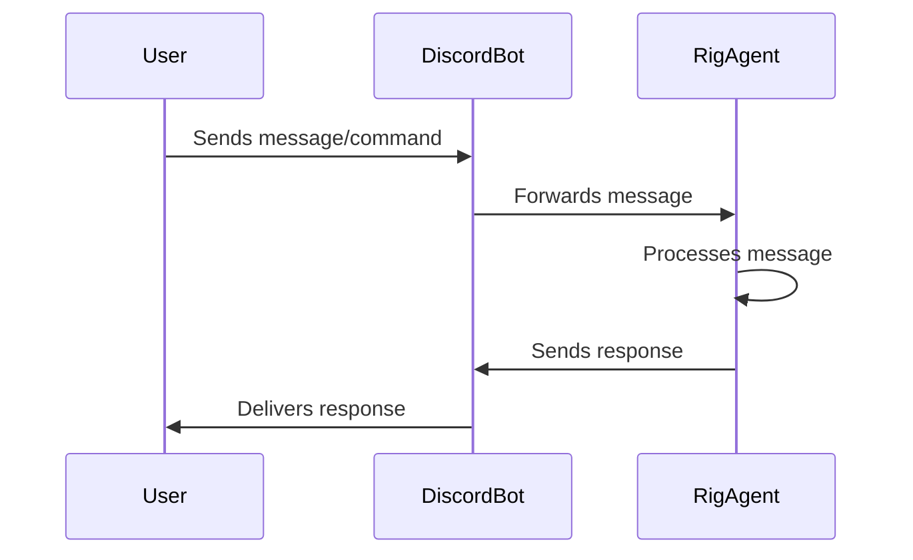

# Build an AI Discord Bot with Rust and Rig: Step-by-Step Guide

**TL;DR**: *This comprehensive guide walks you through creating an AI-powered Discord bot using Rust and the Rig library. You'll learn to set up your environment, build a language model agent, and integrate it with Discord. By the end, you'll have an AI-powered chatbot that answers questions based on your own documents, provides coding assistance, and serves as an automated support tool.*

---

## Introduction

Welcome to the next installment of the **Build with Rig** series. In this hands-on tutorial, we'll construct a fully functional AI Discord bot using Rust and the Rig library. Our bot will be capable of:

1. Answering user queries using a custom Markdown-based knowledge base
2. Offering coding assistance and explanations
3. Serving as an automated customer service or community assistance tool

Throughout this guide, we'll cover:

- Setting up your Rust development environment
- Implementing a language model agent with Rig
- Integrating the bot with Discord
- Deploying and testing the bot

While this guide assumes some familiarity with Rust, LLMs, and Discord, don't worry if this is your first Rust project. We'll focus on practical implementation, explaining key concepts and design decisions along the way.

By the end of this tutorial, you'll have a working AI Discord bot and a solid grasp of building LLM-powered applications with Rig.

Let's dive in.

> 💡 *If you're new to Rig and want to start from the beginning or are looking for additional tutorials, check out our [blog series](https://rig.rs/build-with-rig-guide.html).*

---

## Prerequisites

Before we begin building, ensure you have the following:

- **[Rust](https://www.rust-lang.org/tools/install)**: If you haven't already, install Rust.
- **[Discord Account and Bot Setup](https://discord.com/developers/docs/getting-started)**: You'll need a Discord account and a bot application. Follow the [Discord bot setup guide](https://discord.com/developers/docs/getting-started).
- **[OpenAI API Key](https://platform.openai.com/signup/)**: To enable AI capabilities, integrate the OpenAI API by obtaining an API key from OpenAI. [Sign up for an OpenAI API key](https://platform.openai.com/signup/).

Don't worry if you're new to [Rig](https://rig.rs/)—we'll cover everything you need to know as we progress. For more detailed information about Rig, visit our [GitHub repository](https://github.com/0xPlaygrounds/rig) or explore the [Rig documentation](https://docs.rs/rig-core/latest/rig/).

> **Important**: Never commit your API keys or `.env` files to version control. Ensure your `.gitignore` file includes these files to prevent accidental exposure.

---

## Project Setup

With the prerequisites in place, let's set up our Rust project and install the necessary dependencies.

### 1. Initialize a New Rust Project

Open your terminal and run the following commands:

```bash
cargo new discord_rig_bot
cd discord_rig_bot
```

This creates a new Rust project called `discord_rig_bot` and navigates into the project directory.

### 2. Add Dependencies

Open the `Cargo.toml` file in your project directory and add the following dependencies under the `[dependencies]` section:

```toml
[dependencies]
rig-core = "0.2.1" # [Rig Crate](https://crates.io/crates/rig-core)
tokio = { version = "1.34.0", features = ["full"] }
serenity = { version = "0.11", default-features = false, features = ["client", "gateway", "rustls_backend", "cache", "model", "http"] }
dotenv = "0.15.0"
anyhow = "1.0.75"
tracing = "0.1"
tracing-subscriber = "0.3"
reqwest = { version = "0.11", features = ["json"] }
serde = { version = "1.0", features = ["derive"] }
serde_json = "1.0"
schemars = "0.8"
async-trait = "0.1.83"
```

These dependencies play crucial roles in our project:

- **[Rig](https://rig.rs/)**: The core library for building language model applications, simplifying the integration of AI capabilities into our Discord bot.
- **[Serenity](https://docs.rs/serenity/)**: A third-party library for interacting with the Discord API.
- **[Tokio](https://tokio.rs/)**: An asynchronous runtime for Rust, allowing our bot to handle multiple tasks concurrently.
- Additional crates for error handling (`anyhow`), logging (`tracing`, `tracing-subscriber`), making HTTP requests (`reqwest`), and serialization (`serde`, `serde_json`, `schemars`).

---

## Understanding the Bot Architecture

Our bot consists of two main components that work together to provide an intelligent and interactive user experience:

1. **Rig Agent (`rig_agent.rs`)**: The core of our bot's magic touch. The Rig agent manages AI interactions, handles natural language processing, retrieves relevant information from a Markdown-based knowledge base using Rig's integrated Retrieval-Augmented Generation (RAG) capabilities, and generates contextually appropriate responses.

2. **Discord Bot (`main.rs`)**: The interface between our AI and users. The Discord bot manages communication with Discord, listens for user commands and messages, and sends the generated responses back to the user.

### Message Processing Flow

To understand how our bot works, let's walk through the message processing flow:

1. **User Input**: A user sends a message or command in a Discord channel where the bot is present.

2. **Discord Bot**: The bot, always listening for new messages, receives the user's input and passes it to the Rig agent for processing.

3. **Rig Agent**: The agent processes the user's input, retrieves relevant information from the knowledge base, and generates an appropriate response using its language understanding and generation capabilities.

4. **Response**: The Discord bot receives the generated response from the Rig agent and sends it back to the user in the Discord channel.

Here's a simplified diagram of the message processing flow:



For an in-depth look at building a RAG system with Rig, refer to our comprehensive [article on building a simple RAG system with Rig](https://dev.to/0thtachi/build-a-rag-system-with-rig-in-under-100-lines-of-code-4422).

---

## Building the Rig Agent (`rig_agent.rs`)

The Rig agent is the brain of our bot, responsible for understanding user queries, retrieving relevant information, and generating intelligent responses. Let's build it step by step.

### 1. Create the `rig_agent.rs` File

In your `src` directory, create a new file named `rig_agent.rs`. This file will contain the implementation of our Rig agent.

### 2. Import Necessary Modules

At the top of `rig_agent.rs`, import the required modules:

```rust
// rig_agent.rs

use anyhow::{Context, Result};
use rig::providers::openai;
use rig::vector_store::in_memory_store::InMemoryVectorStore;
use rig::embeddings::EmbeddingsBuilder;
use rig::rag::RagAgent;
use std::path::Path;
use std::fs;
use std::sync::Arc;
```

These modules provide the necessary functionality for our Rig agent, including error handling (`anyhow`), OpenAI language models and embeddings (`rig::providers::openai`), vector storage (`rig::vector_store::in_memory_store`), embedding generation (`rig::embeddings::EmbeddingsBuilder`), and the agent (`rig::rag::RagAgent`).

### 3. Define the `RigAgent` Struct

Create the `RigAgent` struct that will manage the retrieval and response generation:

```rust
pub struct RigAgent {
    rag_agent: Arc<RagAgent<openai::CompletionModel, rig::vector_store::InMemoryVectorIndex<openai::EmbeddingModel>, rig::vector_store::NoIndex>>,
}
```

The `RigAgent` struct contains an `Arc` (Atomic Reference Counting) pointer to a `RagAgent`. The `Arc` type allows multiple parts of your program to share ownership of the same data in a thread-safe way.

> **Note**: [`Arc`](https://doc.rust-lang.org/std/sync/struct.Arc.html) stands for *Atomic Reference Counting*. It is used for sharing data between threads safely.

### 4. Implement the `new` Method

The `new` method is responsible for initializing the Rig agent, setting up the OpenAI client, loading and embedding the knowledge base documents, and creating the RAG agent.

Before we proceed, think about why we use `Arc` here. Since our bot will handle multiple asynchronous events, sharing the `RigAgent` across different parts of the program without transferring ownership is crucial. `Arc` provides a thread-safe way to do this.

```rust
impl RigAgent {
    pub async fn new() -> Result<Self> {
        // Initialize OpenAI client
        let openai_client = openai::Client::from_env();
        let embedding_model = openai_client.embedding_model("text-embedding-3-small");

        // Create vector store
        let mut vector_store = InMemoryVectorStore::default();

        // Get the current directory and construct paths to markdown files
        let current_dir = std::env::current_dir()?;
        let documents_dir = current_dir.join("documents");

        let md1_path = documents_dir.join("Rig_guide.md");
        let md2_path = documents_dir.join("Rig_faq.md");
        let md3_path = documents_dir.join("Rig_examples.md");

        // Load markdown documents
        let md1_content = Self::load_md_content(&md1_path)?;
        let md2_content = Self::load_md_content(&md2_path)?;
        let md3_content = Self::load_md_content(&md3_path)?;

        // Create embeddings and add to vector store
        let embeddings = EmbeddingsBuilder::new(embedding_model.clone())
            .simple_document("Rig_guide", &md1_content)
            .simple_document("Rig_faq", &md2_content)
            .simple_document("Rig_examples", &md3_content)
            .build()
            .await?;

        vector_store.add_documents(embeddings).await?;

        // Create index
        let context_index = vector_store.index(embedding_model);

        // Create RAG agent
        let rag_agent = Arc::new(openai_client.context_rag_agent("gpt-4")
            .preamble("You are an advanced AI assistant powered by [Rig](https://rig.rs/), a Rust library for building LLM applications. Your primary function is to provide accurate, helpful, and context-aware responses by leveraging both your general knowledge and specific information retrieved from a curated knowledge base.

                    Key responsibilities and behaviors:
                    1. Information Retrieval: You have access to a vast knowledge base. When answering questions, always consider the context provided by the retrieved information.
                    2. Clarity and Conciseness: Provide clear and concise answers. Ensure responses are short and to the point. Use bullet points or numbered lists for complex information when appropriate.
                    3. Technical Proficiency: You have deep knowledge about Rig and its capabilities. When discussing Rig or answering related questions, provide detailed and technically accurate information.
                    4. Code Examples: When appropriate, provide Rust code examples to illustrate concepts, especially when discussing Rig's functionalities. Always format code examples for proper rendering in Discord by wrapping them in triple backticks and specifying the language as 'rust'. For example:
                        \`\`\`rust
                        let example_code = \"This is how you format Rust code for Discord\";
                        println!(\"{}\", example_code);
                        \`\`\`
                    ")
            .dynamic_context(2, context_index)
            .build());

        Ok(Self { rag_agent })
    }

    // ... we'll add more code here as we build things out
}
```

Let's break down the key steps:

- **Initialize OpenAI Client**: The OpenAI client is set up using the API key stored in the environment variables. This client is essential for accessing OpenAI's language models and embedding services.

- **Embedding Model**: The `text-embedding-3-small` model is selected for generating document embeddings. This model creates compact vector representations of text, enabling efficient semantic search and retrieval.

- **Vector Store**: An in-memory vector store is created to hold and manage the document embeddings. Vector stores are optimized for fast similarity searches, allowing the agent to quickly find relevant information based on the user's query.

- **Load Documents**: Markdown files containing the knowledge base are loaded from the `documents` directory. In this example, we have three files: `Rig_guide.md`, `Rig_faq.md`, and `Rig_examples.md`. These files contain information about the Rig library, frequently asked questions, and usage examples.

- **Create Embeddings**: The loaded documents are converted into vector embeddings using the `EmbeddingsBuilder` provided by Rig. These embeddings capture the semantic meaning of the documents, enabling the agent to understand and retrieve relevant information based on the user's query.

- **Agent Creation**: A `RagAgent` is created by combining the language model (GPT-4) with the vector store containing the document embeddings. The agent is capable of retrieving relevant information from the knowledge base and generating contextually appropriate responses.

- **Preamble**: A carefully crafted preamble sets up the assistant's behavior and guidelines. The preamble defines the agent's primary function, responsibilities, and expected behaviors, ensuring that it provides accurate, concise, and technically proficient responses.

> **Tip**: For more advanced configurations and techniques, such as implementing custom vector stores or configuring custom agents and tools, refer to the [official Rig examples](https://github.com/0xPlaygrounds/rig/tree/main/rig-core/examples).

### 5. Implement the `load_md_content` Function

The `load_md_content` function is a helper function that reads the content of a Markdown file from the specified file path:

```rust
fn load_md_content<P: AsRef<Path>>(file_path: P) -> Result<String> {
    fs::read_to_string(file_path.as_ref())
        .with_context(|| format!("Failed to read markdown file: {:?}", file_path.as_ref()))
}
```

This function takes a generic parameter `P` that implements the `AsRef<Path>` trait, allowing it to accept various types that can be converted to a file path. It uses the `fs::read_to_string` function to read the contents of the file and returns the content as a `String`. If the file cannot be read, an error is returned with additional context information.

### 6. Implement the `process_message` Function

The `process_message` function is responsible for processing user messages and generating responses using the agent:

```rust
pub async fn process_message(&self, message: &str) -> Result<String> {
    self.rag_agent.prompt(message).await.map_err(anyhow::Error::from)
}
```

This function takes a user message as input and passes it to the RAG agent's `prompt` method. The RAG agent retrieves relevant information from the knowledge base based on the user's query and generates a contextually appropriate response. The generated response is then returned as a `String`. If an error occurs during the processing, it is mapped to an `anyhow::Error` for consistent error handling.

---

### Customizing the Knowledge Base

While we've used Rig's own documentation for our knowledge base, you can personalize your bot by using your own documents. Here's how:

1. **Prepare Your Documents**: Place your Markdown files in the `documents` directory. Ensure they have clear and descriptive filenames.

2. **Modify the File Paths**: In `rig_agent.rs`, update the file paths to match your document names.

   ```rust
   // Example
   let my_doc_path = documents_dir.join("my_custom_doc.md");
   let my_doc_content = Self::load_md_content(&my_doc_path)?;
   ```

3. **Update the Embeddings Builder**: Adjust the `EmbeddingsBuilder` to include your documents.

   ```rust
   let embeddings = EmbeddingsBuilder::new(embedding_model.clone())
       .simple_document("My Custom Doc", &my_doc_content)
       .build()
       .await?;
   ```

This way, your bot will use your own content to generate responses.

---

## Integrating with Discord (`main.rs`)

With our Rig agent implementation complete, it's time to connect it to Discord using the [Serenity library](https://docs.rs/serenity/). Serenity is an async-first Rust library for the Discord API, providing a simple and efficient way to create Discord bots.

### 1. Modify `main.rs` to Include the Rig Agent

At the top of `main.rs`, import the necessary modules and your `rig_agent`:

```rust
// main.rs

mod rig_agent;

use anyhow::Result;
use serenity::async_trait;
use serenity::model::application::command::Command;
use serenity::model::application::interaction::{Interaction, InteractionResponseType};
use serenity::model::gateway::Ready;
use serenity::model::channel::Message;
use serenity::prelude::*;
use serenity::model::application::command::CommandOptionType;
use std::env;
use std::sync::Arc;
use tracing::{error, info, debug};
use rig_agent::RigAgent;
use dotenv::dotenv;
```

These imports bring in the essential types and traits from the Serenity library, as well as the `RigAgent` struct from the `rig_agent` module. The `dotenv` crate is used to load environment variables from a `.env` file.

### 2. Store the Bot's User ID

Define a key for storing the bot's user ID using Serenity's `TypeMapKey` trait:

```rust
struct BotUserId;

impl TypeMapKey for BotUserId {
    type Value = serenity::model::id::UserId;
}
```

This key allows us to store and retrieve the bot's user ID from Serenity's `TypeMap`, which is a type-safe key-value store used for sharing data across event handlers.

### 3. Define the `Handler` Struct

Create the `Handler` struct that holds the `RigAgent`:

```rust
struct Handler {
    rig_agent: Arc<RigAgent>,
}
```

The `Handler` struct is responsible for handling Discord events and interactions. It contains an `Arc<RigAgent>`, which is a thread-safe reference-counting pointer to the Rig agent. This allows the handler to share the Rig agent across multiple event handlers without transferring ownership.

### 4. Implement the `EventHandler` Trait

Implement the `EventHandler` trait for the `Handler` struct to define how the bot should handle various Discord events:

```rust
#[async_trait]
impl EventHandler for Handler {
    async fn interaction_create(&self, ctx: Context, interaction: Interaction) {
        // ... handle interactions
    }

    async fn message(&self, ctx: Context, msg: Message) {
        // ... handle messages
    }

    async fn ready(&self, ctx: Context, ready: Ready) {
        // ... handle readiness
    }
}
```

The `EventHandler` trait is provided by Serenity and defines a set of methods that are called when specific events occur. In this implementation, we define three event handlers:

1. `interaction_create`: Called when a user interacts with the bot, such as using a slash command or clicking a button.

2. `message`: Called when a message is sent in a channel where the bot is present.

3. `ready`: Called when the bot successfully connects to Discord and is ready to receive events.

#### Handling Interactions

In the `interaction_create` event handler, we process slash commands received from Discord:

```rust
async fn interaction_create(&self, ctx: Context, interaction: Interaction) {
    debug!("Received an interaction");
    if let Interaction::ApplicationCommand(command) = interaction {
        debug!("Received command: {}", command.data.name);
        let content = match command.data.name.as_str() {
            "hello" => "Hello! I'm your helpful Rust and Rig-powered assistant. How can I assist you today?".to_string(),
            "ask" => {
                let query = command
                    .data
                    .options
                    .get(0)
                    .and_then(|opt| opt.value.as_ref())
                    .and_then(|v| v.as_str())
                    .unwrap_or("What would you like to ask?");
                debug!("Query: {}", query);
                match self.rig_agent.process_message(query).await {
                    Ok(response) => response,
                    Err(e) => {
                        error!("Error processing request: {:?}", e);
                        format!("Error processing request: {:?}", e)
                    }
                }
            }
            _ => "Not implemented :(".to_string(),
        };

        debug!("Sending response: {}", content);

        if let Err(why) = command
            .create_interaction_response(&ctx.http, |response| {
                response
                    .kind(InteractionResponseType::ChannelMessageWithSource)
                    .interaction_response_data(|message| message.content(content))
            })
            .await
        {
            error!("Cannot respond to slash command: {}", why);
        } else {
            debug!("Response sent successfully");
        }
    }
}
```

Let's break down the process:

1. When an interaction is received, we first check if it's a slash command using the `Interaction::ApplicationCommand` enum variant.

2. If it's a slash command, we match on the command name to determine the appropriate action.

   - For the `"hello"` command, we respond with a simple greeting message.

   - For the `"ask"` command, we extract the user's query from the command options. If no query is provided, we use a default message.

3. If the command is `"ask"`, we pass the user's query to the Rig agent's `process_message` method to generate a response.

   - If the Rig agent successfully generates a response, we send it back to the user.

   - If an error occurs during processing, we log the error and send an error message to the user.

4. For any other command, we respond with a "Not implemented" message.

5. Finally, we create an interaction response using `command.create_interaction_response`, specifying the response type as `ChannelMessageWithSource` and setting the response content to the generated message.

This implementation allows users to interact with the bot using slash commands, providing a structured way to ask questions and receive responses from the Rig agent.

#### Handling Messages

In the `message` event handler, we respond when the bot is mentioned in a message:

```rust
async fn message(&self, ctx: Context, msg: Message) {
    if msg.mentions_me(&ctx.http).await.unwrap_or(false) {
        debug!("Bot mentioned in message: {}", msg.content);

        let bot_id = {
            let data = ctx.data.read().await;
            data.get::<BotUserId>().copied()
        };

        if let Some(bot_id) = bot_id {
            let mention = format!("<@{}>", bot_id);
            let content = msg.content.replace(&mention, "").trim().to_string();

            debug!("Processed content after removing mention: {}", content);

            match self.rig_agent.process_message(&content).await {
                Ok(response) => {
                    if let Err(why) = msg.channel_id.say(&ctx.http, response).await {
                        error!("Error sending message: {:?}", why);
                    }
                }
                Err(e) => {
                    error!("Error processing message: {:?}", e);
                    if let Err(why) = msg
                        .channel_id
                        .say(&ctx.http, format!("Error processing message: {:?}", e))
                        .await
                    {
                        error!("Error sending error message: {:?}", why);
                    }
                }
            }
        } else {
            error!("Bot user ID not found in TypeMap");
        }
    }
}
```

Here's how the message handling works:

1. When a message is received, we first check if the bot is mentioned in the message using the `mentions_me` method.

2. If the bot is mentioned, we retrieve the bot's user ID from the `TypeMap` using the `BotUserId` key.

3. If the bot's user ID is found, we remove the mention from the message content to extract the actual query.

4. We pass the processed message content to the Rig agent's `process_message` method to generate a response.

   - If the Rig agent successfully generates a response, we send it back to the channel where the message was received using `msg.channel_id.say`.

   - If an error occurs during processing, we log the error and send an error message to the channel.

5. If the bot's user ID is not found in the `TypeMap`, we log an error.

This implementation allows users to interact with the bot by mentioning it in a message, providing a more natural way to ask questions and receive responses from the Rig agent.

#### Handling Bot Readiness

In the `ready` event handler, we set up slash commands and store the bot's user ID:

```rust
async fn ready(&self, ctx: Context, ready: Ready) {
    info!("{} is connected!", ready.user.name);

    {
        let mut data = ctx.data.write().await;
        data.insert::<BotUserId>(ready.user.id);
    }

    let commands = Command::set_global_application_commands(&ctx.http, |commands| {
        commands
            .create_application_command(|command| {
                command
                    .name("hello")
                    .description("Say hello to the bot")
            })
            .create_application_command(|command| {
                command
                    .name("ask")
                    .description("Ask the bot a question")
                    .create_option(|option| {
                        option
                            .name("query")
                            .description("Your question for the bot")
                            .kind(CommandOptionType::String)
                            .required(true)
                    })
            })
    })
    .await;

    println!("Created the following global commands: {:#?}", commands);
}
```

Here's what happens in the `ready` event handler:

1. When the bot successfully connects to Discord, the `ready` event is triggered.

2. We log a message indicating that the bot is connected, using the bot's name from the `Ready` struct.

3. We store the bot's user ID in the `TypeMap` using the `BotUserId` key. This allows us to access the bot's user ID in other event handlers.

4. We create global slash commands using the `Command::set_global_application_commands` method.

   - We define two commands: `"hello"` and `"ask"`.

   - The `"hello"` command is a simple command that greets the user.

   - The `"ask"` command allows users to ask the bot a question. It has a required `"query"` option of type `String` where users can input their question.

5. We print the created global commands for debugging purposes.

### 5. Implement the `main` Function

In the `main` function, we set up the bot and start it:

```rust
#[tokio::main]
async fn main() -> Result<()> {
    dotenv().ok();

    tracing_subscriber::fmt()
        .with_max_level(tracing::Level::DEBUG)
        .init();

    let token = env::var("DISCORD_TOKEN").expect("Expected DISCORD_TOKEN in environment");

    let rig_agent = Arc::new(RigAgent::new().await?);

    let intents = GatewayIntents::GUILD_MESSAGES
        | GatewayIntents::DIRECT_MESSAGES
        | GatewayIntents::MESSAGE_CONTENT;

    let mut client = Client::builder(&token, intents)
        .event_handler(Handler {
            rig_agent: Arc::clone(&rig_agent),
        })
        .await
        .expect("Err creating client");

    if let Err(why) = client.start().await {
        error!("Client error: {:?}", why);
    }

    Ok(())
}
```

Here's a step-by-step breakdown of the main function:

1. We load environment variables from the `.env` file using `dotenv().ok()`.

2. We initialize the `tracing_subscriber` to set up logging with a maximum log level of `DEBUG`.

3. We retrieve the Discord bot token from the `DISCORD_TOKEN` environment variable.

4. We create a new instance of the `RigAgent` and wrap it in an `Arc` for thread-safe sharing.

5. We define the gateway intents, specifying the events we want to receive from Discord.

6. We create a new Discord client using the `Client::builder` method, passing in the bot token and intents.

7. We set the event handler for the client to an instance of the `Handler` struct, passing the `RigAgent` wrapped in an `Arc`.

8. We start the client using `client.start()` and handle any errors that may occur.

---

## Running and Testing the Bot

Now that our Discord bot is complete, let's run it and test its functionality.

### 1. Set Up Environment Variables

Create a `.env` file in the root of your project with the following content:

```
DISCORD_TOKEN=your_discord_bot_token
OPENAI_API_KEY=your_openai_api_key
```

Replace `your_discord_bot_token` with your actual Discord bot token and `your_openai_api_key` with your OpenAI API key.

> **Important**: Never commit your `.env` file or API keys to version control. Add `.env` to your `.gitignore` file to prevent accidental exposure.

### 2. Run the Bot

In your terminal, navigate to the project directory and run the following command:

```bash
cargo run
```

If everything is set up correctly, you should see logs indicating that the bot is connected and the global commands have been created.

### 3. Invite the Bot to Your Discord Server

To invite the bot to your Discord server, follow these steps:

- Go to the [Discord Developer Portal](https://discord.com/developers/applications) and select your bot application.
- Navigate to the "OAuth2" section and click on "URL Generator".
- Under "Scopes", select `bot` and `applications.commands`.
- Under "Bot Permissions", select `Send Messages`, `Read Message History`, etc.
- Copy the generated URL and paste it into your browser.
- Select the server you want to invite the bot to and click "Authorize".

### 4. Test the Bot

Once the bot is running and invited to your server, you can test its functionality:

- **Slash Commands**:
  - Type `/hello` to receive a greeting.
  - Use `/ask` followed by a question to interact with the bot and receive a response generated by the Rig agent.

- **Mentions**:
  - Mention the bot in a message with a question, like `@BotName How do I use Rig?`, and the bot will process your question and respond accordingly.

Here are some screenshots of the bot responding to the `/ask` command:


---

## Error Handling and Logging

Now that we've built and tested the bot, we need to ensure we are properly handling errors and logging our bot's behavior for improvement purposes. Rust provides powerful libraries like `anyhow` and `tracing` for error handling and logging.

### 1. Error Handling with `anyhow`

The [`anyhow`](https://docs.rs/anyhow/) crate provides a flexible and easy-to-use error handling solution. It allows us to propagate and handle errors with additional context, making it easier to diagnose and fix issues. Here's an example of using `anyhow` in our `rig_agent.rs` file:

```rust
use anyhow::{Context, Result};

// Example in rig_agent.rs
fn load_md_content<P: AsRef<Path>>(file_path: P) -> Result<String> {
    fs::read_to_string(file_path.as_ref())
        .with_context(|| format!("Failed to read markdown file: {:?}", file_path.as_ref()))
}
```

In this example, we use the `with_context` method to provide additional context to the error, specifying the file path that failed to be read. This context is included in the error message, making it easier to identify the source of the error.

### 2. Logging with `tracing`

The [`tracing`](https://docs.rs/tracing/) crate provides a powerful and flexible logging solution that allows us to log messages at different levels of verbosity. Here's how we can set up logging in our `main.rs` file:

```rust
use tracing::{info, error, debug};
use tracing_subscriber;

// Initialize tracing in main.rs
tracing_subscriber::fmt()
    .with_max_level(tracing::Level::DEBUG)
    .init();
```

In this example, we initialize the `tracing_subscriber` with a maximum log level of `DEBUG`. This means that all log messages with a severity level of `DEBUG` or higher will be captured and displayed.

Throughout our bot's code, we can use the `info!`, `error!`, and `debug!` macros to log messages at different severity levels, providing insights into the bot's behavior.

---

## Troubleshooting Common Issues

If you encounter errors, here are some common issues and how to resolve them:

- **API Key Errors**: Ensure your OpenAI API key and Discord token are correctly set in your `.env` file. Double-check for typos or extra spaces.

- **File Not Found**: If you receive a "Failed to read markdown file" error, check that your document paths are correct and the files exist in the `documents` directory.

- **Dependency Conflicts**: Run `cargo update` to ensure all dependencies are up to date.

- **Permission Errors**: Ensure your bot has the necessary permissions in your Discord server, such as sending messages and reading message history.

---

## Testing and Debugging Guidance

### Testing the Rig Agent Independently

Before integrating with Discord, you can test the Rig agent independently to ensure it's working as expected. Here's how:

```rust
// Test the RigAgent in main.rs

#[tokio::main]
async fn main() -> Result<()> {
    dotenv().ok();

    let rig_agent = RigAgent::new().await?;
    let response = rig_agent.process_message("What is Rig?").await?;
    println!("Response: {}", response);

    Ok(())
}
```

Run `cargo run` to see the output. This test confirms that the Rig agent can process messages and generate responses based on your knowledge base.

---

## Enhancing Your Bot

Congratulations! You've built a functional AI-powered Discord bot. Now, let's explore some ways to enhance it.

### 1. Expand the Knowledge Base

To make your bot more knowledgeable and versatile, consider adding more Markdown files to the `documents` directory. These files can cover a wide range of topics, from FAQs to technical documentation and beyond.

### 2. Customize the Bot's Behavior

The behavior of your bot is largely determined by the preamble defined in the `rig_agent.rs` file. By adjusting this preamble, you can fine-tune how the bot interacts with users, shaping its personality, tone, and overall approach to conversations. Experiment with different preambles to find the right balance for your bot's intended purpose and audience.

### 3. Add More Commands

Slash commands provide a structured and intuitive way for users to interact with your bot. Consider implementing additional commands in the `main.rs` file to extend your bot's functionality. For example, you could add commands for retrieving specific information, performing calculations, or triggering automated workflows.

### 4. Integrate Other APIs

To further enhance your bot's capabilities, consider integrating it with other APIs. For example, you could connect your bot to a weather API to provide real-time weather updates or integrate it with a news API to deliver the latest headlines. By leveraging external APIs, you can create powerful workflows and automate tasks within your Discord server.

> *Check out our guide on building agent tools and integrating APIs [here](https://rig.rs/build-with-rig-guide.html). You can also find more examples in the official [Rig repo](https://github.com/0xPlaygrounds/rig/tree/main/rig-core/examples).*

---

## Conclusion

In this guide, we've successfully built an AI-powered Discord bot using Rust and [Rig](https://rig.rs/). We've learned how to set up your environment, build a language model agent, integrate with Discord, and run your bot. With this foundation, you can continue to enhance and customize your bot, transforming it into a more robust system of autonomous agents to suit your needs.

See you in the next guide in the Build with Rig series!
---

## Code Files

For reference, here are the complete `rig_agent.rs` and `main.rs` files.

### `rig_agent.rs`

```rust
// rig_agent.rs

use anyhow::{Context, Result};
use rig::providers::openai;
use rig::vector_store::in_memory_store::InMemoryVectorStore;
use rig::embeddings::EmbeddingsBuilder;
use rig::rag::RagAgent;
use std::path::Path;
use std::fs;
use std::sync::Arc;


pub struct RigAgent {
    rag_agent: Arc<RagAgent<openai::CompletionModel, rig::vector_store::InMemoryVectorIndex<openai::EmbeddingModel>, rig::vector_store::NoIndex>>,
}

impl RigAgent {
    pub async fn new() -> Result<Self> {
        // Initialize OpenAI client
        let openai_client = openai::Client::from_env();
        let embedding_model = openai_client.embedding_model("text-embedding-3-small");

        // Create vector store
        let mut vector_store = InMemoryVectorStore::default();

        // Get the current directory and construct paths to markdown files
        let current_dir = std::env::current_dir()?;
        let documents_dir = current_dir.join("documents");

        let md1_path = documents_dir.join("Rig_guide.md");
        let md2_path = documents_dir.join("Rig_faq.md");
        let md3_path = documents_dir.join("Rig_examples.md");

        // Load markdown documents
        let md1_content = Self::load_md_content(&md1_path)?;
        let md2_content = Self::load_md_content(&md2_path)?;
        let md3_content = Self::load_md_content(&md3_path)?;

        // Create embeddings and add to vector store
        let embeddings = EmbeddingsBuilder::new(embedding_model.clone())
            .simple_document("Rig_guide", &md1_content)
            .simple_document("Rig_faq", &md2_content)
            .simple_document("Rig_examples", &md3_content)
            .build()
            .await?;

        vector_store.add_documents(embeddings).await?;

        // Create index
        let context_index = vector_store.index(embedding_model);

        // Create RAG agent
        let rag_agent = Arc::new(openai_client.context_rag_agent("gpt-4")
            .preamble("You are an advanced AI assistant powered by [Rig](https://rig.rs/), a Rust library for building LLM applications. Your primary function is to provide accurate, helpful, and context-aware responses by leveraging both your general knowledge and specific information retrieved from a curated knowledge base.

                    Key responsibilities and behaviors:
                    1. Information Retrieval: You have access to a vast knowledge base. When answering questions, always consider the context provided by the retrieved information.
                    2. Clarity and Conciseness: Provide clear and concise answers. Ensure responses are short and to the point. Use bullet points or numbered lists for complex information when appropriate.
                    3. Technical Proficiency: You have deep knowledge about Rig and its capabilities. When discussing Rig or answering related questions, provide detailed and technically accurate information.
                    4. Code Examples: When appropriate, provide Rust code examples to illustrate concepts, especially when discussing Rig's functionalities. Always format code examples for proper rendering in Discord by wrapping them in triple backticks and specifying the language as 'rust'. For example:
                        \`\`\`rust
                        let example_code = \"This is how you format Rust code for Discord\";
                        println!(\"{}\", example_code);
                        \`\`\`
                    ")
            .dynamic_context(2, context_index)
            .build());

        Ok(Self { rag_agent })
    }

    pub async fn process_message(&self, message: &str) -> Result<String> {
        self.rag_agent.prompt(message).await.map_err(anyhow::Error::from)
    }
}
```

### `main.rs`

```rust
// main.rs

mod rig_agent;

use anyhow::Result;
use serenity::async_trait;
use serenity::model::application::command::Command;
use serenity::model::application::interaction::{Interaction, InteractionResponseType};
use serenity::model::gateway::Ready;
use serenity::model::channel::Message;
use serenity::prelude::*;
use serenity::model::application::command::CommandOptionType;
use std::env;
use std::sync::Arc;
use tracing::{error, info, debug};
use rig_agent::RigAgent;
use dotenv::dotenv;

// Define a key for storing the bot's user ID in the TypeMap
struct BotUserId;

impl TypeMapKey for BotUserId {
    type Value = serenity::model::id::UserId;
}

struct Handler {
    rig_agent: Arc<RigAgent>,
}

#[async_trait]
impl EventHandler for Handler {
    async fn interaction_create(&self, ctx: Context, interaction: Interaction) {
        debug!("Received an interaction");
        if let Interaction::ApplicationCommand(command) = interaction {
            debug!("Received command: {}", command.data.name);
            let content = match command.data.name.as_str() {
                "hello" => "Hello! I'm your helpful Rust and Rig-powered assistant. How can I assist you today?".to_string(),
                "ask" => {
                    let query = command
                        .data
                        .options
                        .get(0)
                        .and_then(|opt| opt.value.as_ref())
                        .and_then(|v| v.as_str())
                        .unwrap_or("What would you like to ask?");
                    debug!("Query: {}", query);
                    match self.rig_agent.process_message(query).await {
                        Ok(response) => response,
                        Err(e) => {
                            error!("Error processing request: {:?}", e);
                            format!("Error processing request: {:?}", e)
                        }
                    }
                }
                _ => "Not implemented :(".to_string(),
            };

            debug!("Sending response: {}", content);

            if let Err(why) = command
                .create_interaction_response(&ctx.http, |response| {
                    response
                        .kind(InteractionResponseType::ChannelMessageWithSource)
                        .interaction_response_data(|message| message.content(content))
                })
                .await
            {
                error!("Cannot respond to slash command: {}", why);
            } else {
                debug!("Response sent successfully");
            }
        }
    }

    async fn message(&self, ctx: Context, msg: Message) {
        if msg.mentions_me(&ctx.http).await.unwrap_or(false) {
            debug!("Bot mentioned in message: {}", msg.content);

            let bot_id = {
                let data = ctx.data.read().await;
                data.get::<BotUserId>().copied()
            };

            if let Some(bot_id) = bot_id {
                let mention = format!("<@{}>", bot_id);
                let content = msg.content.replace(&mention, "").trim().to_string();

                debug!("Processed content after removing mention: {}", content);

                match self.rig_agent.process_message(&content).await {
                    Ok(response) => {
                        if let Err(why) = msg.channel_id.say(&ctx.http, response).await {
                            error!("Error sending message: {:?}", why);
                        }
                    }
                    Err(e) => {
                        error!("Error processing message: {:?}", e);
                        if let Err(why) = msg
                            .channel_id
                            .say(&ctx.http, format!("Error processing message: {:?}", e))
                            .await
                        {
                            error!("Error sending error message: {:?}", why);
                        }
                    }
                }
            } else {
                error!("Bot user ID not found in TypeMap");
            }
        }
    }

    async fn ready(&self, ctx: Context, ready: Ready) {
        info!("{} is connected!", ready.user.name);

        {
            let mut data = ctx.data.write().await;
            data.insert::<BotUserId>(ready.user.id);
        }

        let commands = Command::set_global_application_commands(&ctx.http, |commands| {
            commands
                .create_application_command(|command| {
                    command
                        .name("hello")
                        .description("Say hello to the bot")
                })
                .create_application_command(|command| {
                    command
                        .name("ask")
                        .description("Ask the bot a question")
                        .create_option(|option| {
                            option
                                .name("query")
                                .description("Your question for the bot")
                                .kind(CommandOptionType::String)
                                .required(true)
                        })
                })
        })
        .await;

        println!("Created the following global commands: {:#?}", commands);
    }
}

#[tokio::main]
async fn main() -> Result<()> {
    dotenv().ok();

    tracing_subscriber::fmt()
        .with_max_level(tracing::Level::DEBUG)
        .init();

    let token = env::var("DISCORD_TOKEN").expect("Expected DISCORD_TOKEN in environment");

    let rig_agent = Arc::new(RigAgent::new().await?);

    let intents = GatewayIntents::GUILD_MESSAGES
        | GatewayIntents::DIRECT_MESSAGES
        | GatewayIntents::MESSAGE_CONTENT;

    let mut client = Client::builder(&token, intents)
        .event_handler(Handler {
            rig_agent: Arc::clone(&rig_agent),
        })
        .await
        .expect("Err creating client");

    if let Err(why) = client.start().await {
        error!("Client error: {:?}", why);
    }

    Ok(())
}
```

---

**Thank you for following along!** If you have any questions or run into issues, feel free to reach out or consult the resources provided. Happy coding!